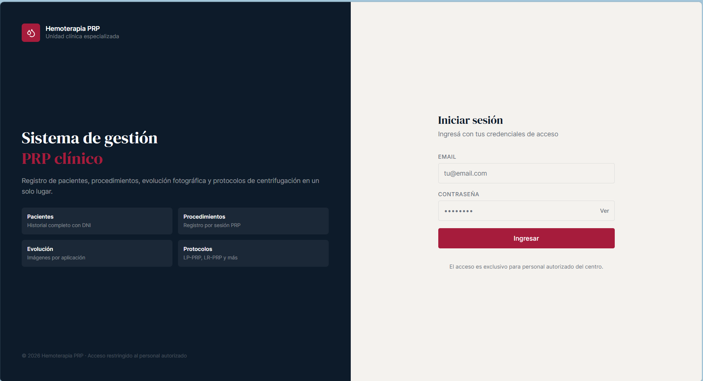
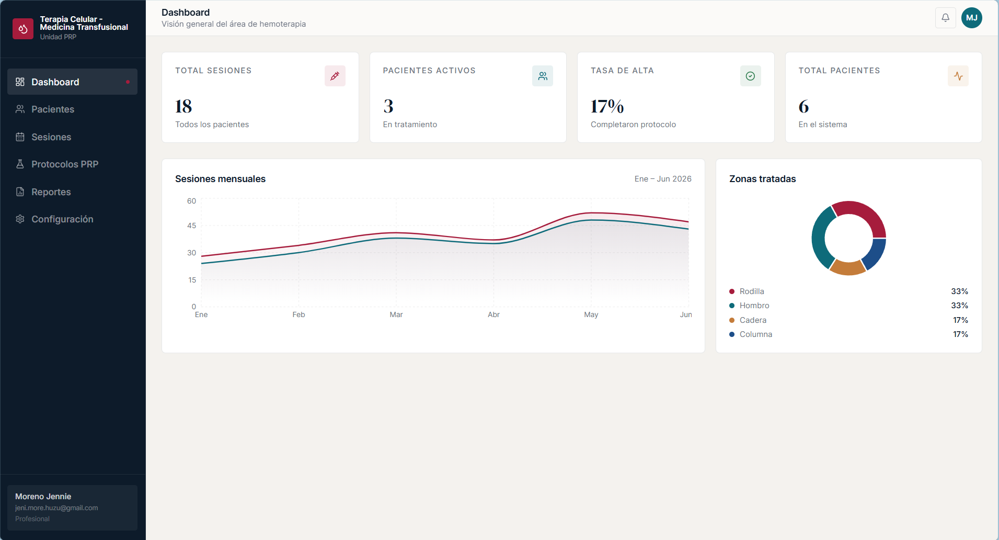
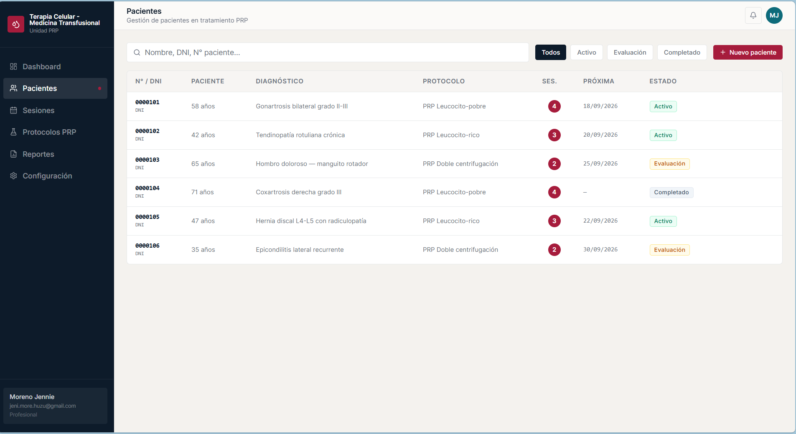
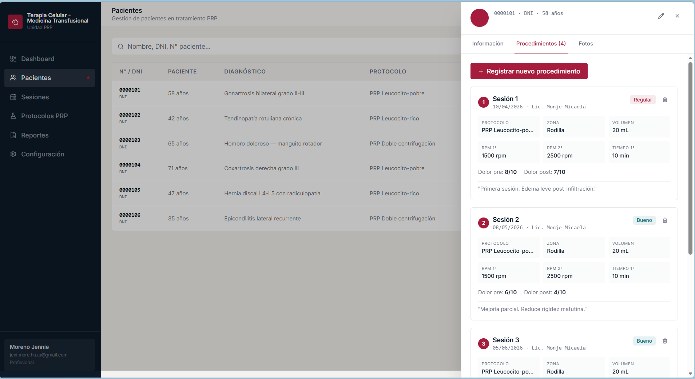
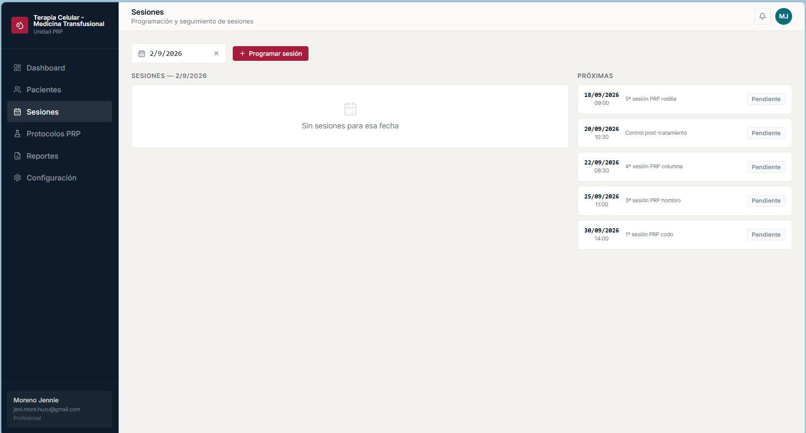
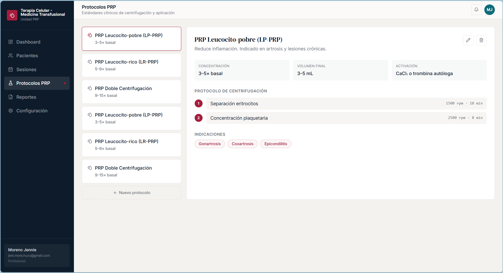
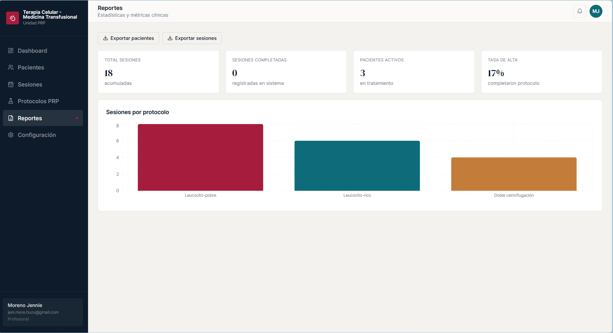

#  Sistema de Gestión de Medicina Transfusional - PRP Clínico
###  Creadora, Product Owner & QA Lead

Este software es una plataforma web especializada en la gestión, trazabilidad y control de tratamientos de **Plasma Rico en Plaquetas (PRP)** y terapia celular. 

>  **Autoría y Desarrollo:** El sistema fue ideado, diseñado y construido íntegramente por mí, integrando herramientas avanzadas de Inteligencia Artificial para acelerar la generación de código, la lógica de negocio y la documentación técnica. Este repositorio funciona como un caso de estudio donde demuestro mi capacidad para liderar un producto digital desde la concepción hasta su despliegue, combinando experiencia clínica con prácticas de aseguramiento de calidad bajo estándares del sector HealthTech.

---

##  Recorrido del Sistema y Alcance del Testing

### 1. Control de Acceso y Seguridad - Login
*   **Descripción de la Pantalla:** Formulario de inicio de sesión con validación de credenciales y acceso restringido al personal autorizado.
*   **Estrategia de Calidad Aplicada:** Validación de políticas de autenticación, manejo seguro de tokens y bloqueo automático ante intentos de acceso no autorizados a la base de datos de hemoterapia.
*   **Captura de Interfaz:**
    

---

### 2. Panel de Control y Métricas Clínicas - Dashboard
*   **Descripción de la Pantalla:** Panel principal que centraliza los KPIs operativos (Total de sesiones, Pacientes activos, Tasa de alta) y gráficos analíticos de las sesiones mensuales y distribución por zonas anatómicas tratadas.
*   **Estrategia de Calidad Aplicada:** Verificación de integridad de datos y actualización en tiempo real de las métricas frente a nuevos registros clínicos.
*   **Captura de interfaz:**
    

---

### 3. Gestión y Registro Avanzado de Pacientes
*   **Descripción de la Pantalla:** Grilla con estados clínicos (Activo, Evaluación, Completado), diagnósticos parametrizados y protocolos de PRP asignados.
*   **Estrategia de Calidad Aplicada:** Pruebas funcionales de lo filtros de búsqueda rápida por numero de paciente, control de paginación del listado y inserción de nuevos registros clínicos anonimizados.
*   **Captura de interfaz:**
    

---

### 4. Detalle y Trazabilidad del Paciente Clínico
*   **Descripción de la Pantalla:** Vista interna del perfil de un paciente donde se registra el historial de aplicaciones de PRP, evolución sintomática y notas de control médico.
*   **Estrategia de Calidad Aplicada:** Persistencia de datos al cambiar entre pestañas del expediente y correcta vinculación del ID del paciente con su historial clínico.
*   **Captura de interfaz:**
    

---

### 5. Agenda y Programación de Sesiones
*   **Descripción de la Pantalla:** Calendario y agenda cronológica para el control técnico de citas médicas pendientes en el área de terapia celular.
*   **Estrategia de Calidad Aplicada:** Control de lógica relacional en la asignación de fechas futuras y disparo de alertas visuales en la interfaz ante superposición de turnos médicos.
*   **Captura de interfaz:**
    

---

### 6. Configuración de Protocolos de Centrifugación - Core Médico
*   **Descripción de la Pantalla:** Catálogo de protocolos (LP-PRP y LR-PRP) con detalle de las fases críticas del proceso: separación de eritrocitos y concentración plaquetaria, parametrizadas por valores de RPM y tiempos de centrifugado.
*   **Estrategia de Calidad Aplicada:** Pruebas de valores límite en RPM y tiempos de centrifugado para garantizar seguridad en el procesamiento de muestras.
*   **Capturas de interfaz:**
    

---

### 7. Módulo de Reportes Estadísticos y Exportación
*   **Descripción de la Pantalla:** Panel de auditoría de sesiones totales filtradas por tipo de protocolo aplicado a lo largo del año.
*   **Estrategia de Calidad Aplicada:** Verificación de consistencia en exportaciones CSV/Excel para auditorías institucionales.
*   **Capturas de interfaz:**
    

---

##  Matriz de Pruebas Destacadas 

| ID | Módulo | Descripción del Caso de Prueba | Tipo de Prueba | Resultado Esperado |
| :--- | :--- | :--- | :--- | :--- |
| **TC-PAC-001** | Barra de Búsqueda | Ingresar un DNI que no existe en el sistema (ej: `99999999`). | Validación de Campos | La grilla debe vaciarse y mostrar un mensaje claro de *"No se encontraron pacientes"*, sin romper la interfaz. |
| **TC-PAC-002** | Filtros de Estado | Hacer clic en el botón de filtro `Evaluación`. | Funcional (Sanity) | La tabla debe actualizarse instantáneamente mostrando **únicamente** los pacientes cuyo estado sea `Evaluación`. |
| **TC-PAC-003** | Badge de Sesiones | Verificar que el contador de `SES.` (círculo rojo) sea un número entero mayor a cero. | Reglas de Negocio | El sistema no debe permitir valores negativos ni decimales en las sesiones acumuladas de tratamiento. |

---

##  Habilidades Técnicas Demostradas en este Proyecto
*   **Aseguramiento de Calidad - Domain Knowledge:** Aplicación de criterios de prueba basados en normativas médicas y procesos biológicos reales (centrifugación de plasma, resguardo de datos de pacientes).
*   **Diseño de Datos de Prueba - Test Data Design:** Creación de perfiles clínicos ficticios complejos para pruebas de cobertura funcional de extremo a extremo E2E.
*   **Desarrollo asistido por IA:** Optimización, estructuración y aceleración de código mediante técnicas de prompt engineering.
